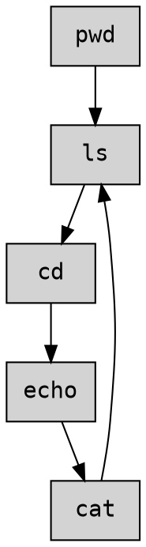
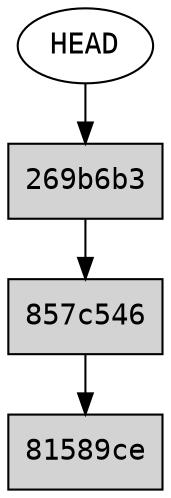
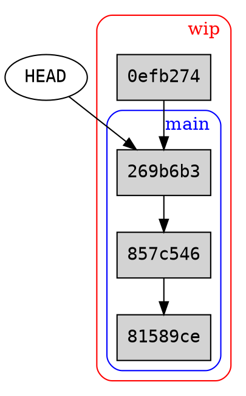
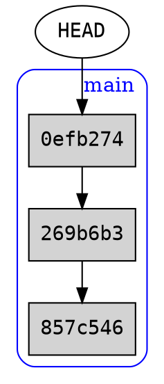
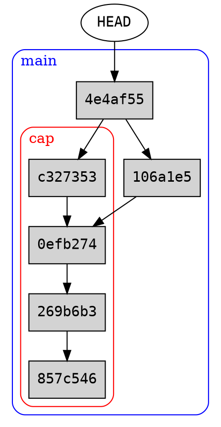
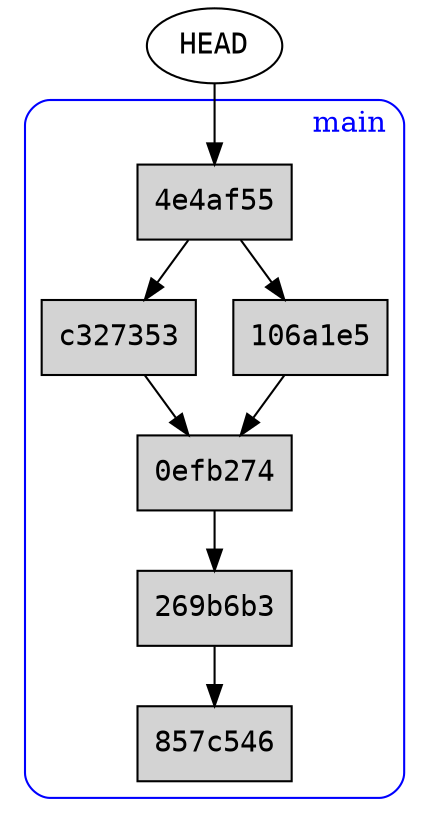

# Git tutorial at the DSL

This is a follow along tutorial with exercises. All sections that have a grey areas (code chunks), like `git add`, are for you to type into your own terminal. Exercises are shown in blue, and are for you to attempt using the knowledge from each section.

We will focus on the contents of chapters 2 and 3 of [Pro Git](http://git-scm.com/book/en/v2). It will also contain practical instructions on installation of Git and using GitHub. This tutorial should take about 2-3 hours in total, but we encourage you to take some time to play around with the concepts!

## What is Git
Git is a set of tools that enable tracking changes of any collection of files while enabling robust collaborative workflow. Git tracks changes through atomic commits which can be made at any frequency by any number of people, which is especially useful to teams in many different time zones. It has been successfully utilized by large teams of remote developers all over the world and grown out to be a de facto standard in software development.

## Interfaces
Graphical user interfaces (for example in web browsers, desktop operating systems, or smartphones) are great for ad hoc tasks, like web browsing, or moving files, or connecting to a WiFi. For those working with software, command line interfaces offer a fast, precise and very lightweight alternative. The main idea is that we can write a command one line at a time, and every such command is saved, evaluated, and its return value is pasted in lines below where we are. This repeats until we stop it. This is called a Read Evaluate Print Loop (REPL), and it is in fact how you can use most scripting languages such as Python or R! Now, the arguably most useful kind of REPL is one that we call a _shell_. These are programs which are supposed to give us access to the operating system from the user's perspective (hence the name), including many standardized smaller programs which ["do one thing and do it well"](https://en.wikipedia.org/wiki/Unix_philosophy). One of those programs will be Git!

Git itself is written only as such a command line application. There are many secondary interfaces to Git, including many graphical. These can be very useful, but learning Git as a command line application has some advantages
1. Many more advanced but very useful Git features are not widely implemented in these interfaces; command line Git is the model implementation which is followed by all secondary wrappers
2. Most programmers will prefer to use Git as a command line interface, and you might have to collaborate with them!
3. Knowing a little bit of shell is useful! Sometimes we might have to work on unknown interfaces, or use programs that are only available in the text form (writing graphical interfaces is costly)

Working in a shell will look something like this

```shell=bash
shell> ls
some_file.txt    some_other_file.txt
shell> pwd
/home/dsl
shell> git help
```
We will drop the `shell>` prefix (a.k.a. shell prompt) in the future examples so that they are easy to copy and paste to your actual shell. That said, we do encourage you to type out the commands anyway!

## Installation
For Windows, use the appropriate version [here](http://git-scm.com/download/win) (if you're not sure, choose the "__64-bit Git for Windows setup__") and pick "Bash" during the installation. 

For MacOS, go [here](http://git-scm.com/download/mac) and use either the binary installer, or the [Homebrew distribution](https://brew.sh/) if you have that installed. Homebrew is a package manager for MacOS, enabling you to install and maintain programs such as Python securely, easily and with a single command.

On Linux, you most likely already have Git installed! If not, install it with your stock package manager.


## Using the command line

The command line is an interface that processes commands to your computer through text instead of using your mouse. The Git for Windows will come with an implementation of Bash, the classic Linux shell that is most standard, and included in MacOS. 


Opening the command line

- Windows
    - Open start menu
    - Type "Git Bash"
- Mac OS
    - Press `⌘` (command) + space
    - Type "Terminal"

:::	info
_Exercise 0_.
You should now have the command line open. Below is a sequence of exercises to help you get used to using the command line.
:::

Type `pwd` into the command line. This stands for "print working directory" and outputs the directory you are currently in. Running this now will show your user directory, which is where you will always start when opening the command line.
```shell=bash
pwd
```

Type `ls`. You should get a list of files and directories such as Desktop and Documents. This stands for "list files".
```shell=bash
ls
```

We will now create a new directory called `somewhere` using `mkdir` ("make directory"). You can see your new directory listed in `ls`.
```shell=bash
mkdir somewhere
ls
```

You can use `cd`, which stands for "change directory", to move to any location. You can give either a relative path (anything that's listed by `ls`) or an absolute path. Let's check where we are, then go `somewhere` and check where we are again to see your path has now changed. We can also see the new directory is empty as `ls` shows nothing.
```shell=bash
pwd
cd somewhere
pwd
ls
```

:::success
You can use `Tab` to autocomplete your commands. If you type `cd som` and press `Tab`. If there are many options, you will see them listed.
:::

Let's make a text file by directing output of `echo` to a filename. Echo prints supplied text and `>` puts it into a file, which is created if it doesn't exist. Beware that if you use `>` on an existing file, it will be overwritten. To append to an existing file, use `>>` instead. 
```shell=bash
echo "Hello world!" > file.txt
ls
```

To read the file type `cat file.txt`, which stands for "concatenate", as it can be used to print contents of multiple files together. Another option is to use `head file.txt`, which will print top 10 lines. This is very useful for large files!
```shell=bash
cat file.txt
head file.txt
```

As mentioned, we can append to our file with `>>`.
```shell=bash
echo "I wrote this using the command line!" >> file.txt
cat file.txt
```

Moving though files one by one can be slow if you already know the path. We can go to a particular directory by putting such path as argument to `cd`. There are some useful shortcuts we can use as well: `~` expands to your user directory and `..` expands to the directory immediately above the one you are in. So we can go to `~/somewhere` and then escape back to `~` by going to `..`.

```shell=bash
cd ~/somewhere
cd ..
pwd
```

We can run any command with a full path instead of going to directories. So for example

```shell=bash
head ~/somewhere/file.txt
```

:::success
Windows uses the back slash rather than the forward slash, so there we'd need something like `somewhere\file.txt`. The rest of this tutorial doesn't use absolute paths as such, so don't worry too much about it!
:::

We will have a go at deleting our `file.txt` we made using the `rm`, which stands for "remove". Note that removing files this way actually removes them (there is no trash folder). To be cautious, we can add the `-i` option which double checks we want to remove the file. Type `y` to confirm and `n` to ignore.
```shell=bash
rm -i file.txt
```

To remove a directory (possibly with some files or other directories inside), we can add `-r` ("recursive") option to `rm`.

```shell=bash
mkdir folder-to-delete
rm -ri folder-to-delete
```

Finally, we can use the `clear` command to empty the terminal, should it become too cluttered.
```shell=bash
clear
```

You can also access what command we ran with `history`. This is what your command line stores and that can be also accessed with up and down arrows from the terminal. In particular, if you ran some command and you want to run it again but with different parameters, or if you made a mistake, you can simply press an arrow up, make changes and run it again!

To summarise, we put the mentioned commands in the table below.

| **Syntax** | **What it does**                                         | **Example output**                 |
|:----------:|----------------------------------------------------------|-----------------------------------------|
|     pwd    | Prints your current path          | /User/somewhere                  |
|     ls     | Lists files in the current path | file.txt spreadsheet.xlsx  document.doc |
|     cd     | Changes working directory                                |    ---                        |
|    mkdir <name>   | Creates a new directory          | ---                           |
|    echo    | Makes a file, such as .txt (text file)                   | echo content of file > file.txt         |
|   history  | Lists previous commands                                  | 381 pwd                                 |
|   cat      | Concatenates files, allowing us to display in command line| cat file.txt                           |
|   head      | Displays first 10 lines of file | head file.txt                           |

An example workflow using the command line might be to move through a few file directories, make a directory, make a text file, then list the files in the directory to see your new file.



## Doing it locally
Git can be very useful locally on your computer, that is, offline. It is also a base for further remote features, so we start here.

### Configuration
We first need to configure some things. Git requires all commits to be signed with some name and email. It might be a good idea to use non-primary email address, so that your email is not accessible to the public after you share your repositories.

We also want to change the default branch name from `master` to `main`. This is in support of the recent movement to remove racially-charged language from software, see [e.g. this article](https://www.zdnet.com/article/github-to-replace-master-with-main-starting-next-month/) for more details on this. Git is yet to change this default, so we must set it explicitly here. The word `main` is arbitrary, but is what GitHub chose, so we will use it here as well for consistency.

Change below details to your own email address and name and run the following (feel free to copy and paste first)

```shell=sh
git config --global user.email "digital.skills.lab@lse.ac.uk"
git config --global user.name "Digital Skills Lab"
git config --global init.defaultBranch main
```

We can verify our set up as follows with the `--get` option as follows
```
git config --get user.email
git config --get user.name
git config --get init.defaultBranch
```

We now need to create a Git repository. Running `git init` in some location will create a `.git` directory which will consist of all the relevant information on the Git repository. As in the shell tutorial before, we make sure we are in the user directory and create a directory named `something`. We then go there and initialize our repository.

```shell=bash
cd ~
mkdir something
cd something
git init
```

You should end up with an output along the lines of
>`Initialized empty Git repository in /User/something/.git/`

We now need some content to track with Git. The `echo` prints its supplied argument and the `>` operator puts this printed text to a new text file

```shell=bash
echo eins > one.txt
```

Like we showed in the command line section, you can view our file with the `cat` command
```shell=bash
cat one.txt
```

Finally, we can verify what files are now in `something`. Using `ls` with the `-a` option, we can see all files in a location, including the so-called "hidden locations", which are anything with a name that starts with a dot.

```shell=bash
ls -a
```

In this case, it will show `one.txt` and `.git`.

:::success
The `.git` is a directory which stores all information about the Git repository, apart from the actual files. If you'd ever want to delete the Git structure of a repository, delete this folder.
:::

### Staging and commits
Every contribution in a Git repository is represented as a _commit_. These commits are structured in such a way that it is impossible to "tamper" with the order in which they were applied. This allows for rigid rollback capabilities, and as we will see later, does not impair usability.

In order to commit some changes, we need to specify which parts of the repository we would like to commit changes in, if there are any. This is called staging. There are a couple ways to get "everything" in a repository, but the exact meaning of "everything" differs slightly. Here is a summary
Command|New files|Modified files|Deleted files|Starts with `.`
-|:-:|:-:|:-:|:-:
`git add --all`|Yes|Yes|Yes|Yes
`git add -u`|No|Yes|Yes|Yes
`git add .`|Yes|Yes|No|Yes
`git add *`|Yes|Yes|No|No

For most practical purposes, when you want to add "everything", you want `--all` and if you need to add concrete things, you can specify them explicitly. For example, `git add *.docx` will add all files ending with `.docx`. We can also check the current status of staging using `git status`. 

Putting it all together, we first look at the status, and see `one.txt` as an untracked file. We then add all files and check the status again. The `one.txt` file has now moved to _changes to be committed_!

```shell=bash
git status
git add --all
git status
```

:::success
You can use `git status --short` to get a more compact view of the staged area. You can also keep files that you don't want to ever add by running any catch-all git add command by putting these files or extensions in `.gitignore` file in the repository. For instance you might put `*.docx` to ignore Word files or `__pycache__/` to ignore local Python cache directory.
:::

Now, we would also like to actually commit those changes that happened to files that we added to tracking. To do this, we use the `git commit` command and it is very good practice to add a short, informative commit message with `-m` option. A largely agreed upon convention is that it should be imperative mood ("Do this thing"), capitalized, up to 80 characters, and no dot at the end. It should be read as "when applied, this commit will <commit message>". If we run the command without the `-m` option, Git will open your editor, where you can enter the body of a commit message. This is optional for complicated changes, but as a rule of thumb, one should make commits granular enough to be possible to describe in 80 characters. See [this excellent blog post](https://chris.beams.io/posts/git-commit/) for some reasoning behind all this. Again, we can check the status of tracking with `git status` and we can see the commits using `git log`. Now, putting things together again, we get

```shell=bash
git commit -m "Add German translation"
git status
git log --oneline
```

You will see `(HEAD -> main)` next to the last commit. You should think about `HEAD` as a pointer that can move to different commits, but most of the time, it will be pointing to the last commit. We will explain the meaning of `main` in the next section.

To illustrate the remainder of this section, we have to add more commits to the repository. We use `>>` to append to an existing file. After each commit you will get some infomation from git detailing the changes. 

```shell=bash
echo jeden >> one.txt
git add --all
git commit -m "Add Polish translation"

echo uno >> one.txt
git add --all
git commit -m "Add Italian translation"
```

Now, every commit in Git has a so-called hash attached to it. This is a unique piece of information specific to the changes made by the commit __and__ the commit just before it. This makes arbitrary tampering with previous commit not very practical; one would have to "redo" the whole history of commits up to the point we want to change. There is a good reason for this: we want the commit history to be robust 



We can see a similar "picture" with

```shell=bash
git log --children --oneline
```

Note that the hash codes you get will be different to the ones presented in the image above. 

:::info
_Exercise 1_. Open a new terminal and based the above:

- Create a new folder `dissertation` in your user directory
- Go there and initialize a Git repository
- Create a new text file using `echo` like we showed earlier
- Add this file to tracking and commit
- Open the text file and put some text (can be e.g. from your dissertation)<!-- To open with the terminal try `open -t file.txt` which opens your default text editor (*note: your file might not be called file.txt*) -->
- Add and commit the file again
- Check what `git status` and `git log --oneline` say along the way

Keep the terminal open, as we will continue this exercise!
:::

### Branching
The `main` we saw in the previous section is the default branch of our repository. Branches in Git are "parallel timelines" in which we can develop ideas without making changes to the primary source material, and that we can later merge when the work is done.

We can see the current branches with `git branch -va` (option `-v` adds verbosity and option `-a` adds remote branches which we will see in later sections).

We can create a new branch with `git branch <name of this branch>`. We can switch to an existing branch with `git checkout <name of that branch>`. 

Putting it all together, we first check what branch we are in, then create a new branch `wip` and switch to it with `git checkout` and finally review what branch we are in again. You should see a `*` next to the `wip` branch -- this signifies the current active branch we are in.

```shell=bash
git branch -va
git branch wip
git checkout wip
git branch -va
```

:::success
The word `wip` is a common acronym used in software and it stands for "work in progress".
:::

To move back to the main branch, we use `git checkout` again. The `*` should now have moved back to main.

```shell=bash
git checkout main
git branch -va
```

Now, we make some changes in the new branch we created and commit within this branch. Every branch has its own log, which we can see as before with `git log`.

```shell=bash
git checkout wip
echo zwei >> two.txt
git add --all
git commit -m "Extend German translation to 'two'"
git log --oneline
```

We can now see that the `(main)` was left behind in on the last commit to `main` and that the `HEAD` points to `wip`, in the most recent commit in that branch. Let us now come back to `main` and see it again

```shell=bash
git checkout main
git log --oneline
```

No mention of the new changes at all! This is what we meant by a "parallel universe". New branches can copy and edit the state of `main`, but can't be seen from `main` itself.



:::info
_Exercise 2_. Continuing from the last exercise:

- Create a new branch named `wordcount` and checkout to it
- Count the words in your file (e.g. using [wordcounter.net](https://wordcounter.net/)) and add it to your file
- Add and commit the changes
- Check `git status` and `git log --oneline`
- Checkout back to `main` and look at the file
- _Bonus question_: why is the word count not there?
:::

### Merging
Once we make some changes in a parallel branch we can merge back to `main`. If there are no conflicts, this is a very straightforward operation.

```shell=bash
git checkout main
git merge wip
git log --oneline
```

We can now see that the commit we made in the `wip` branch was added to the `main` branch and so the `HEAD` points to both. You should see something like
>`1fa22c4 (HEAD -> main, wip) Extend German translation to 'two'.`

We can now delete that branch with `git branch -d` as we no longer need it

```shell=bash
git branch -va
git branch -d wip
git log --oneline
git branch -va
```

And we see now that `wip` disappeared from the log, as well as from the branch list. We return to a picture similar to what we saw before branches.



:::info
_Exercise 3_. Continuing from the last exercise:
- Merge the `wordcount` branch into the main branch
- Is the word count there now?
- Check the log on `main`
- Delete the `wordcount` branch
:::

## Merge conflicts

Suppose there is some ambiguity in how the branches should be merged, for example due to changes made to the same file concurrently. This is called a _merge conflict_. Continuing with our translation example, we will recreate the following situation
1. First someone was tasked with capitalizing every word in our dictionary
2. While capitalization was carried in a new branch, someone added more translations to `two.txt`

We can create a new branch and checkout it in one command by adding `-b` option to `git checkout`. We do so below.

```shell=bash
git checkout -b capitalize
```

We now edit the files as described

```shell=bash
echo Eins > one.txt
echo Jeden >> one.txt

echo Uno >> one.txt
echo Zwei > two.txt
```

You can view these changes with `cat`

```shell=bash
cat one.txt
cat two.txt
```

And now we stage and commit everything

```shell=bash
git add --all
git commit -m "Capitalize translations"
```

:::success
Extra information for the curious, enter with caution!

If we had a very large file, we would of course use something stronger, like Python. Here is how this could be done on `one.txt` again, but ignore this is you don't know Python.
<br>
```shell=bash
cp one.txt tmp.txt
cat tmp.txt |
python -c "import sys; \
    [print(l.strip().capitalize()) \
    for l in sys.stdin]" > one.txt
rm tmp.txt
```

The pipe, `|`, will pass output of a command as input to the next command. In our case, we pass the contents of `tmp.txt` into Python's `sys.stdin` object, and do the work in Python. The `print` calls produce output which we then direct to `one.txt` with the `>` operator.
:::

Now, we leave these changes in `capitalize` and checkout back to `main` to add more translations to `two.txt`.

```shell=bash
git checkout main

echo dwa >> two.txt
echo due >> two.txt

git add --all
git commit -m "Add Polish and Italian translations to 'two'"
```

<!--
:::success
The backslash, `\`, (not to confuse with Windows backslash) simply allows us to write the command in a new line, without triggering execution with pressing enter. Shorter lines are usually easier to read, especially in small terminal windows!
:::
-->

You can now try to merge your two branches (main and capitalize). Upon running

```shell=bash
git merge capitalize
```

we get an error on the attempt to auto-merge the two branches. Git will automatically enter a special staging area called `main|MERGING`.


We can abort the merge with `git merge --abort` or we can try to resolve it.

You can view the conflits by viewing the two.txt file

```shell=bash
head two.txt
```

The conflicting file `two.txt` is temporarily changed to contain the options, as follows

```
<<<<<<< HEAD
zwei
dwa
due
=======
Zwei
>>>>>>> capitalize
```

Everything between `HEAD` and `=======`  is the option from the current branch (we checked out to `main`). Everything under `=======` up to `capitalize` are is the version from the new branch. 

Now, to resolve this, we have to manually put it into the form we would like to have in the end. So we can either remove everything from one block and leave the other untouched, or write something entirely new. You must remove all the non-content marks like `<<<<` and `===` manually as well, Git will not remove these automatically.

As our resolution, let's remove the capitalization block, but also capitalize words from the main block to correspond with changes in `one.txt`. We hence want to obtain

```
Zwei
Dwa
Due
```

We can open the file to make the edits using the open command. This will open your default text editor. 

```shell=bash
open one.txt
```

We can then edit the text file. To save what you've done then exit your text editor. Then we view our file and the changes with head. You should have Zwei, Dwa, and Due on each line

```shell=bash
head one.txt
```

When we save and close `two.txt`, we are still in the special merging area.


To finalize our resolution, we need to commit our change, preferably with an informative commit message.

```
git add --all
git commit -m "Merge capitalize to main"
git log --oneline
```

We can see the current situation with `git log`, which is as in this picture below



And if we delete the `capitalize` branch and look at the log, we just get a `main` with _three_ new commits: one from each change together with one made when merging.

```
git branch -d capitalize
git log --oneline --graph
```



<!--
:::warning
(To be removed probably)

This gets the job done, but we could have coordinated better and had a cleaner commit history. Sometimes making our strategy explicit is a good thing, as some resolutions might be very non-trivial.  But sometimes, saving this information risks cluttering the commit history with these merge messages. We could of course revert to before the conflict and redo the work sequentially with meaningful commits. But in practice, this is cumbersome: there is another way called _rebasing_.

Let us first revert back to our conflict. To do this, we run `reflog`, the "Git's time machine"

<br>

```shell=bash
git reflog --no-abbrev
```
- Find commit hash and "recover" `cap` branch
- Reflog to appropriate HEAD
- Rebase
:::
-->

:::info
_Exercise 4_. Continuing from the last exercise:
- Create a new branch called `uppercase`
- Switch to the new branch
- Change the first word of the first paragraph in your text file to be all uppercase
- Commit changes in this branch
- Go back to `main`
- Make the second word uppercase and commit to `main`
- Try to merge `uppercase` to `main` and resolve any conflicts that might come up
:::

## Doing it remotely
Remote collaboration is at the heart of Git. The project for which Git was originally developed, the Linux kernel, to this day uses the so-called patch workflow. This means that developers send to each other _patches_ or _diffs_ which are recipes of how the repository should be updated. Developers would maintain their own copies of the codebase.

Today, we fortunately have tools to make this much more efficient and beginner-friendly, and one of those tools is GitHub. It is an online platform on which users can store Git repositories and work together on an effectively centralized version. GitHub is based on pure Git methodology of a _remote_ and all what you have learned in the previous section will be crucial, as even though a GitHub repository lives online, we will work on a copy of it offline and _push_ our work as we see fit. A _remote_ is a centralized version of a repository that may reside on the internet somewhere. See [Pro Git 2.5](http://git-scm.com/book/en/v2/Git-Basics-Working-with-Remotes) for details.

So we need a remote server to act as a single source of truth. Big projects often have _mirrors_, read-only copies of the repository. For example, Linux kernel has [one at GitHub](https://github.com/torvalds/linux), but the actual development happens through patches over email. This is an old-school way of doing things -- we will use GitHub for our centralized server.

First, go on [GitHub](https://github.com/) and create an account. It is advised that you choose your username as something you like, as though it is possible to change it later, GitHub won't store redirections to repositories referencing your old username. So, if you share `username/repository` but then change your name to `username1`, people visiting that shared link will get an error and will not get to `username1/repository`. Furthermore, GitHub makes it very easy to host a personal webpage under `username.github.io` but also does not redirect from old usernames.


Next we need to generate a Personal Access Token to authenticate our command line. To do so, follow [this short guide](https://docs.github.com/en/github/authenticating-to-github/keeping-your-account-and-data-secure/creating-a-personal-access-token). It's also good practice to give it some expiration date. Only scope you need for repositories is `repo`, so choose this one. **You will only see it once, so make sure you copy it and save it somewhere!**

Now let us manually create a repository on GitHub.
- Go to GitHub and log into your account
- Create a new repository and name it `some-repository`
- Choose a name and write some meaningful description
- Choose private for now
- Don't add `README`, `.gitignore` and a license for now

GitHub will now give you some ideas on what to do next, and we go through it now. Go to your local repository you did all the work in.

:::success
The name of the repository is an unknown concept to Git -- it is simply the name of the directory which contains the repository. Nevertheless, in order to differentiate between different user's repositories, it is necessary to specify it for GitHub.
:::

You can work with several remotes, but in this case we will only work with one. We add such a remote and customarily name it `origin`. Run the following and make sure to substitute `<username>` with your GitHub username. You can also just copy the exact line from the recommended GitHub instruction you just saw.

```
git remote add origin https://github.com/<username>/some-repository.git
```

GitHub will also recommend you to run a `git branch -M main`, which is there to force a rename of whatever branch you are on to `main`, which is necessary to work with GitHub. This is our default branch name already, so if you haven't, just switch to it with `git checkout main` and you are good!

Now we need to _push_ our changes to our new remote. We do so as follows. You will be prompted for username and password. For the password, use your Personal Access Token.
```
git push -u origin main
```

If we take a look at `git branch -va`, we will see a new `remotes/origin/main` branch, with same commit as the one on the `main` branch. If you refresh the GitHub page, you will now see the code, along with the commit history, and many other things! Note that we only pushed the `main` branch, so other branches are not accessible from the online interface. You often want to push other branches of course, as you might collaborate with other people within a parallel branch.

Okay, let's now simulate a real situation of working with someone else. Open a new terminal, crate a new directory and clone the repository. Cloning a remote repository means downloading a copy of everything that's on that remote. It's a "fresh start" that is usually the first step to do if you want to contribute to someone's work, or just download and play with their code.

```
mkdir someone-else
cd someone-else
git clone https://github.com/<username>/some-repository.git
cd some-repository
```

Substitute `<username>` with your GitHub username and make sure to end the repository URL with `.git`. Since your repository is private, you will again need to provide the Personal Access Token.

Now, make some changes and push. Go back to your old location and run `git fetch`. This will update the state of our local copy of the remote. If you run `git branch -va` you will see that now `main` is `[behind 1]` which means it is one commit behind compared to the remote. So we are now in the known situation of having to merge changes from some local branch to `main`.

Since there are no conflicts, we can simply merge the two branches with `git merge origin/main main`. This action is so popular, there is a special command `git pull` which will do exactly what we did: first fetch and then merge to `main`.

:::info
_Exercise 5_. Using remotes:

* Make a repository on GitHub and link it to the local repository you've been using in the previous exercises
* Make an edit to your word count file to add more text
* Push the file to GitHub and commit it
* Go to GitHub to see your changes, and make some edits to the file in GitHub
* Go back to the command line and pull the changes you made from GitHub
:::

## The end
You should now have a basic competency on how to use Git and GitHub. Of course, there are many problems one can encounter on a larger scale, such as complex merge conflicts. Two pull requests that change the same file differently could be submitted at the same time, and someone has to decide how to actually apply the changes to the repository. In professional software development, testing is a necessity and there are many ways to automate a set of test to run on every commit to the repository.

For more advanced techniques such as rebasing, conflict resolution or hooks (custom behavior on Git actions), see Pro Git book. Here are also some articles on how to organize open repositories and some examples of successful projects managed in Git.

For further reading, check out the rest of the [Pro Git](https://git-scm.com/book/en/v2) book (we only went through core parts of chapters 2 and 3). Other interesting resources are

- [Dangit, Git!](https://dangitgit.com/)
- [Happy Git for R](https://happygitwithr.com/)
- [Git Flight Rules](https://github.com/k88hudson/git-flight-rules)
- [Hacker's Guide to Git](https://wildlyinaccurate.com/a-hackers-guide-to-git/)
- [Useful Flags and Aliases](https://blog.jakuba.net/git-command-overview-with-useful-flags-and-aliases/)
- [Problems with Pull Requests](https://gregoryszorc.com/blog/2020/01/07/problems-with-pull-requests-and-how-to-fix-them/)
- [Commit Often, Perfect Later, Publish Once](https://sethrobertson.github.io/GitBestPractices/)

## Appendix

### Aliasing commands
It's important to know what these parts of Git do, and where to look for more complex functionality. That said, in practice we use only a handful of commands, varying things like the style of `git log` output.

For this reason, it is often very useful to _alias_ some more complex pieces of Git to simpler names. For instance you might want to have the following alias handy

```shell=bash
alias ga="git add --all"
```

Any of these settings will disappear when you open a new terminal session, so you have to include them somewhere that is run every time you open a new terminal. One such place is `.bashrc` file in your home directory. Here are some more aliases you can use

```shell=bash
alias gl="git log --oneline"
alias gc="git commit -m"
alias gs="git status --short"
alias gb="git branch -va"
```

This would simplify our workflow to something like this

```shell=bash
mkdir ../quick-tangent/
cd ../quick-tangent/
git init
echo data > file

gs
ga
gc "Add new data"
gl

cd ../some-location/
```

You are encouraged to explore customization that Git has to make a set of aliases perfect for you.

### Some further shell

Brace expansion

```shell=bash
echo a{b,c}e
echo {a,b}{a,b}
echo a{a,}

echo {1..10}
echo {0..100..20}
echo {a..z}

du -sh *.{png,jp{e,}g}
head -1q user{1..10}.txt
```
Command substitution

```shell=bash
echo $(date)
```

Arithmetic

```shell=bash
echo $((77*22))
```

<!--
```
A "follow along" format
Emphasis on Git/Github dichotomy
Glossary? Footnotes?
Using Git with RStudio?
Quiz at the end?

    Merging
    Making a repository
    "Pull" from remote
    Pushing to remote
        Forking
        Pull requests
    Stashing
    Rebasing
    Hooks
```
-->